# LC Connect: Assistant Comparison Kit

**Status: DRAFT, 2026-09-29 (assistant runs done 15:18–15:55 CEST; one post-fix re-verification added at 22:17:59 CEST).** All eight assistant runs behind the comparison in Sections 3–5 are complete. The first four ("Claude"/"ChatGPT" without the connector, plus the first *Claude + LC* attempt) were done 15:18–15:31 CEST. The first *Claude + LC* attempt found the connector switched on but **not called**, because the account had a personal standing instruction to use no connector other than Vendo; that instruction was then lifted and both *Claude + LC* runs were repeated (15:44–15:49 CEST, files suffixed `-v2`) with the connector actually invoked. LC Connect was also installed in the test ChatGPT account (there named "LC Connector") and both *ChatGPT + LC* runs were completed 15:51–15:55 CEST. All answers below are copied from the chats; nothing was invented or estimated. **Separately, after two server fixes landed the same day (commits `d16086e`, `a0dfd53`), the Claude + LC Poland question was re-run at 22:17:59 CEST to verify the fix; that run, plus an intermediate broken check at 16:03 CEST, is added as Section 3.4.**

Prepared for: the Laser Components sales and research team
Prepared by: AutoOffice (LC Connect provider)

## 1. Method

**Purpose.** To show, without embellishment, what a general-purpose AI assistant answers to a typical lead-research question with and without access to Laser Components' own research base through the LC Connect connector. If an assistant names companies that cannot be found or verified, we record that as the finding.

**Questions (identical wording in every run):**

- **Q1.** "List companies in Poland that use pulsed laser diodes (PLD, 905 nm or 1550 nm) in their products, for example laser rangefinders, LiDAR or proximity fuzes. For each company give: name, city, the product or application, and how confident you are."
- **Q2.** The same prompt, with "Poland" replaced by "the Czech Republic".

**Why the Czech Republic for Q2.** We counted leads per country in the LC Connect database on 2026-09-29. The best-covered European countries are Poland (14 leads with a country assigned), the Czech Republic (13) and the United Kingdom (8). **Germany has no leads in the research base.** It has never been researched, and it is the natural next step. We chose the Czech Republic because it is the best-covered European country after Poland.

**The five columns:**

| Column | What it means |
|---|---|
| Claude | Claude.ai, new chat, LC Connect turned **off** in the chat's connector menu |
| Claude + LC | Claude.ai, new chat, LC Connect turned **on**; tool permissions approved if asked |
| ChatGPT | ChatGPT, new chat, LC Connect app **not** selected for the chat |
| ChatGPT + LC | ChatGPT, new chat, LC Connect app **selected**; tool permissions approved if asked |
| LC database | Direct read-only query of the live LC Connect server (`search_leads` with a country filter), run as the researcher account of Łukasz Abramek (user 12, role RESEARCHER) |

For every assistant run we save the exact prompt, the full answer text, a full-page screenshot, a screenshot of the connector menu (as evidence of the on/off state), the model name shown in the UI, and the response time. The files are in `raw/`. **Copilot is Laser Components' own platform and was not run.**

**Timing.** Ground-truth queries were run on 2026-09-29 (before 15:15 CEST) against the live server at `127.0.0.1:3003`. Assistant runs: 2026-09-29, 15:18–15:55 CEST (the two *Claude + LC* and two *ChatGPT + LC* runs used in this document are the 15:44–15:55 CEST batch; see the status line above).

**Run conditions, as found (not changed).**

- *Claude.ai:* model label "Opus 5.5 · Medium". Web search was off; Memory was on. Claude Docs and Vendo Connect were switched on in every chat. The LC Connect toggle was off for the *Claude* runs and on for the *Claude + LC* runs. The toggle is remembered between chats, so after the runs it was set back to off. The account's standing "Vendo only" instruction applied to the first four Claude runs (15:18–15:31 CEST); it was then lifted and the two *Claude + LC* runs were repeated at 15:44 and 15:48 CEST with the connector actually called (`search_leads`, "Always allow" granted once).
- *ChatGPT:* Free plan, "Myślenie" (Thinking) mode. For the *ChatGPT* (without) runs no app was selected; ChatGPT ran a web search on its own and cited sources. For the *ChatGPT + LC* runs (15:51 and 15:53 CEST) the "LC Connector" app was selected as a chip in the composer before sending.
- **Screenshots.** They show the visible browser window, not the full scrolled page. The complete answer text is in `raw/<product>-<with|without>-<Q1|Q2>.md` (the repeated *Claude + LC* runs are `raw/claude-with-Q1-v2.md` / `raw/claude-with-Q2-v2.md`).
- **Database changed during the runs.** At 15:19:50 CEST another work stream ran a country back-fill (commit `d280649`, "26 PL/CZ leads assigned, tagged geo:text, revertable"). Poland now has **25** country-tagged leads and the Czech Republic **29**. All eight assistant runs used in this document (15:18–15:55 CEST) postdate this change; the database lists and overlap figures are a live pull taken at 15:39 CEST.
- **What the back-fill did.** The back-fill (`scripts/backfill-geography-text.ts`) is evidence-based: it assigned a country to a lead only where the lead's own description text names a country or a city, and it tagged every changed row `geo:text` so the change is identifiable and revertible. This is not GPS or otherwise independently verified location data — it reflects what the research notes say about a company, not a confirmed address — so it should be read as directional evidence, not ground truth.

**Server changes made during and after the evaluation.**

- **15:35 CEST (before the "+ LC" runs used in this document):** the `search_leads` and `get_leads` MCP tools were changed to accept a combined country + product filter in the same call, and to show a country column in the results. The four "+ LC" runs used in this document (15:44–15:55 CEST) postdate this change; ChatGPT used the combined filter in some `get_leads` calls but still needed 30 tool calls per question in total (Section 3.3/4.3) because no single call combines country, product and a text search the way its own reasoning wanted to slice the data.
- **Later today, after the runs:** the model-visible `search_leads`/`get_leads` result was made more compact (fewer/shorter fields per row), and a presentation rule was added asking the connected assistant to answer per-item fields (city, product, confidence) in text rather than leaving the reader to open the widget. Both changes were made *after* the runs in this document and are not reflected in any of the eight answers — see the "widget only, no per-company text" finding for both *Claude + LC* runs in Sections 3.3, 4.3 and 5.

## 2. What the LC Connect database contains

**This section reflects a live database pull at 2026-09-29 15:39 CEST, superseding the 15:00 snapshot used in the first draft.**

- **396 leads in total.** 177 have a country assigned. **219 have no country** and no location text.
- **Pulsed laser diode leads can be identified.** Every lead is linked to exactly one Laser Components product, meaning the product it is a prospect for. We define "PLD-linked" as a product name matching `Pulsed Laser Diodes%`, which covers *Pulsed Laser Diodes at 905 nm*, *Pulsed Laser Diodes at 1550 nm* and (one Polish lead) *Pulsed Laser Diodes with Fiber Pigtail*. *High Power Laser Diodes* (one Polish lead) does not match that filter and is not counted as PLD-linked — see 3.2. The link records a researched **sales fit**; it does not verify that the company buys PLDs today. The lead descriptions say so plainly, with wording such as "Needs pulsed laser diodes", "Potential buyer" and "HIGH/MEDIUM/LOW FIT".
- **City.** The structured location field is empty for all of these leads. Where a city is known, it appears only inside the free-text description. We quote it below and mark it *(desc.)*; where the description gives no city, the field is left blank rather than guessed.
- **Status and owner.** All Polish and Czech leads have status NEW and no owner assigned. None has a confidence score.
- **How the connector reaches them.** `search_leads` filters by country but not by product. `get_leads` filters by product but not by country. An assistant therefore had to filter by country and read the product column separately at the time of the runs (15:18–15:31 CEST) — see the note at the end of this section about a tool change made afterward.

### Data-quality finding: leads without a country (partially resolved)

The first draft flagged that a country filter misses leads that are clearly Polish or Czech from their legal form or well-known identity but had no `country_id` set. **This has now been partly fixed** by the evidence-based back-fill described in Section 1 — CRW Telesystem-Mesko, TopGaN, Fluence Technology, FIBRAIN, Opt Lasers, VIGO Photonics, PIT-RADWAR, Solaris Optics and SDS Optic all now carry `country_id = Poland`, and Meopta and CRYTUR now carry `country_id = Czech Republic`. **219 leads (of 396) still have no country set**, and a country filter still under-reports until those are resolved. **Recommendation stands:** continue filling in missing countries.

## 3. Q1: Poland

### 3.1 Comparison table

**LC database column refreshed 2026-09-29 15:39 CEST (live pull, post-backfill), replacing the 14-lead pre-backfill snapshot used in the first draft.** The **Claude + LC** and **ChatGPT + LC** columns are the repeated, connector-invoked runs (15:44 and 15:51 CEST); the first *Claude + LC* attempt, where the connector was on but never called, is superseded — see the note below the table. Matched companies (present in both an assistant's answer and the LC database) are **bold**.

| Claude | Claude + LC † | ChatGPT | ChatGPT + LC ‡ | LC database (25) |
|---|---|---|---|---|
| **PCO S.A.** | **Semicon Sp. z o.o.** | **CRW Telesystem-Mesko** | **Etronika Sp. z o.o.** | Autocomp Management Sp. z o.o. |
| **CRW Telesystem-Mesko** | **LiDAR3D Sp. z o.o.** | TOYA S.A. / YATO | **PCO S.A.** | **CRW Telesystem-Mesko Sp. z o.o.** |
| **Mesko S.A.** | **Instytut Optoelektroniki WAT** | AiQ robotics P.S.A. | **Instytut Optoelektroniki WAT** | CTL Laserinstruments Sp. z o.o. |
| Dezamet S.A. | **Wojskowy Instytut Techniczny Uzbrojenia (WITU)** | **MESKO S.A.** | **Zakłady Mechaniczne Tarnów S.A.** | **Etronika Sp. z o.o.** |
| **WB Group (WB Electronics)** | **SDS Optic S.A.** | **PCO S.A.** | **Mesko S.A.** | FIBRAIN Sp. z o.o. |
| **PIT-RADWAR** | **Perspectiva Solutions** | **WB Electronics / WB Group** | **Huta Stalowa Wola S.A.** | Fluence Technology Sp. z o.o. |
| **Huta Stalowa Wola** | **Lukasiewicz-PIAP** |  | **WB Electronics / WB Group** | **Huta Stalowa Wola S.A. (HSW)** |
| Advanced Protection Systems | **CTL Laserinstruments Sp. z o.o.** |  | **Wojskowy Instytut Techniczny Uzbrojenia (WITU)** | Inframet |
| Delta Optical | **Solaris Optics S.A.** |  | **Semicon Sp. z o.o.** | **Instytut Optoelektroniki WAT** |
| Łukasiewicz – Institute of Microelectronics and Photonics | **Opt Lasers (Tomorrow's System Sp. z o.o.)** |  |  | LiDAR3D Sp. z o.o. |
| **WAT, Institute of Optoelectronics** | **OEM Tech Sp. z o.o.** |  |  | Lukasiewicz-PIAP |
| **VIGO Photonics** | **Huta Stalowa Wola S.A. (HSW)** |  |  | **Mesko S.A.** |
|  | **Zakłady Mechaniczne Tarnów S.A. (ZMT)** |  |  | OEM Tech Sp. z o.o. |
|  | **Autocomp Management Sp. z o.o.** |  |  | Opt Lasers (Tomorrow's System Sp. z o.o.) |
|  | *(+ 11 more rows below the widget's scroll — full set = all 25 rows in the LC database column)* |  |  | **PCO S.A.** |
|  |  |  |  | Perspectiva Solutions |
|  |  |  |  | **PIT-RADWAR S.A.** |
|  |  |  |  | SDS Optic S.A. |
|  |  |  |  | **Semicon Sp. z o.o.** |
|  |  |  |  | Solaris Optics S.A. |
|  |  |  |  | TopGaN Sp. z o.o. |
|  |  |  |  | **VIGO Photonics S.A.** |
|  |  |  |  | **WB Electronics S.A. (WB Group)** |
|  |  |  |  | **Wojskowy Instytut Techniczny Uzbrojenia (WITU)** |
|  |  |  |  | **Zakłady Mechaniczne Tarnów S.A. (ZMT)** |

**Notes on the "+ LC" columns (apply throughout this document, Poland and Czech Republic alike):** **†** Claude + LC — the connector was called this time (`search_leads` with a country filter only), and returned the *entire* country list as the LC Connect "Leads — search" widget (25 of 25 rows for Poland, 29 of 29 for the Czech Republic). Claude wrote no text answer naming individual companies, did not filter to pulsed-laser-diode users, and gave no city, product/application or confidence per company — it pointed to the widget and offered to re-run the search or pull per-lead detail. Because the answer is the unfiltered database list, **the match against the LC database is the full column by construction**, not a subset Claude selected; the table shows only the 14 (of 25) and 14 (of 29) rows visible in the saved screenshots before the widget's inner scroll cut them off — the remaining rows are the same list, continued, in the LC database column. The first attempt at this run (superseded, not shown in this table) found the connector switched on but never called, because of an account-level standing instruction restricting connector use to Vendo; that instruction was lifted and the run above is the repeat. **‡** ChatGPT + LC — the app is named "LC Connector" in ChatGPT's UI, not "LC Connect". ChatGPT called it 30 times per question (`search_leads`, `get_leads`, `enrich_lead`), also searched the web unprompted, and wrote a full text table citing sources. Every `enrich_lead` call failed with "PERPLEXITY_API_KEY environment variable is not set" (a server-side configuration gap, being fixed); ChatGPT reported this failure to the user in the Czech Republic answer. ChatGPT calls the data source "Łącznik Vendo" throughout — its own custom-instruction wording — although the data came from LC Connect/LC Connector.

ChatGPT also mentioned Bumar Soldier S.A. as an R&D lead, but said it would not count it as a PLD user (its 1535 nm source is a solid-state microchip laser). Bumar Soldier is not in the LC database.

### 3.2 LC database detail (Poland, country filter)

**Live pull, 2026-09-29 15:39 CEST** (25 leads with `country_id = Poland`; supersedes the 14-lead 15:00 snapshot). 16 of the 25 leads are linked to a product name matching `Pulsed Laser Diodes%` (10 × 905 nm, 5 × 1550 nm, 1 × fiber-pigtailed). The other 9 are linked to LiDAR (7), High Power Laser Diodes (1) or Silicon-PIN photodiodes (1) — the last two do not match the `Pulsed Laser Diodes%` filter and are outside the PLD-linked subset in (b) below. City is quoted only where the lead's own description names one, marked *(desc.)*; otherwise it is left blank.

**(a) All 25 Poland leads**

| Lead | City | LC product link | Website | Status | Owner |
|---|---|---|---|---|---|
| Autocomp Management Sp. z o.o. | Szczecin *(desc.)* | PLD 905 nm | ac-m.pl | NEW | — |
| CRW Telesystem-Mesko Sp. z o.o. | — | LiDAR | telesystem.eu | NEW | — |
| CTL Laserinstruments Sp. z o.o. | Warsaw *(desc.)* | PLD 905 nm | ctl.com.pl | NEW | — |
| Etronika Sp. z o.o. | — | PLD 1550 nm | etronika.pl | NEW | — |
| FIBRAIN Sp. z o.o. | — | PLD, fiber-pigtailed | fibrain.com | NEW | — |
| Fluence Technology Sp. z o.o. | Warsaw *(desc.)* | PLD 905 nm | fluence.technology | NEW | — |
| Huta Stalowa Wola S.A. (HSW) | Stalowa Wola *(desc.)* | PLD 1550 nm | hsw.pl | NEW | — |
| Inframet | — | LiDAR | inframet.com | NEW | — |
| Instytut Optoelektroniki WAT | Warsaw *(desc.)* | PLD 1550 nm | ioe.wat.edu.pl | NEW | — |
| LiDAR3D Sp. z o.o. | — | LiDAR | lidar3d.pl | NEW | — |
| Lukasiewicz-PIAP | Warsaw *(desc.)* | LiDAR | piap.lukasiewicz.gov.pl | NEW | — |
| Mesko S.A. | Skarżysko-Kamienna *(desc.)* | PLD 905 nm | mesko.com.pl | NEW | — |
| OEM Tech Sp. z o.o. | — | PLD 905 nm | oem-tech.pl | NEW | — |
| Opt Lasers (Tomorrow's System Sp. z o.o.) | Warsaw *(desc.)* | High Power Laser Diodes | optlasers.com | NEW | — |
| PCO S.A. | — | LiDAR | pcosa.com.pl | NEW | — |
| Perspectiva Solutions | — | PLD 905 nm | perspectivasolutions.com | NEW | — |
| PIT-RADWAR S.A. | — | LiDAR | en.pitradwar.com | NEW | — |
| SDS Optic S.A. | Lublin *(desc.)* | Silicon-PIN photodiodes | sdsoptic.com | NEW | — |
| Semicon Sp. z o.o. | Warszawa *(desc.)* | PLD 905 nm | semicon.com.pl | NEW | — |
| Solaris Optics S.A. | near Warsaw *(desc.)* | PLD 1550 nm | solarisoptics.eu | NEW | — |
| TopGaN Sp. z o.o. | — | PLD 905 nm | topganlasers.com | NEW | — |
| VIGO Photonics S.A. | — | LiDAR | vigophotonics.com | NEW | — |
| WB Electronics S.A. (WB Group) | — | PLD 1550 nm | wbgroup.pl | NEW | — |
| Wojskowy Instytut Techniczny Uzbrojenia (WITU) | Zielonka *(desc.)* | PLD 905 nm | witu.mil.pl | NEW | — |
| Zakłady Mechaniczne Tarnów S.A. (ZMT) | Tarnów *(desc.)* | PLD 905 nm | zmt.tarnow.pl | NEW | — |

**(b) PLD-linked subset (16 of 25 — product name ILIKE 'Pulsed Laser Diodes%')**

| Lead | City | LC product link | Website | Status | Owner |
|---|---|---|---|---|---|
| Autocomp Management Sp. z o.o. | Szczecin *(desc.)* | PLD 905 nm | ac-m.pl | NEW | — |
| CTL Laserinstruments Sp. z o.o. | Warsaw *(desc.)* | PLD 905 nm | ctl.com.pl | NEW | — |
| Etronika Sp. z o.o. | — | PLD 1550 nm | etronika.pl | NEW | — |
| FIBRAIN Sp. z o.o. | — | PLD, fiber-pigtailed | fibrain.com | NEW | — |
| Fluence Technology Sp. z o.o. | Warsaw *(desc.)* | PLD 905 nm | fluence.technology | NEW | — |
| Huta Stalowa Wola S.A. (HSW) | Stalowa Wola *(desc.)* | PLD 1550 nm | hsw.pl | NEW | — |
| Instytut Optoelektroniki WAT | Warsaw *(desc.)* | PLD 1550 nm | ioe.wat.edu.pl | NEW | — |
| Mesko S.A. | Skarżysko-Kamienna *(desc.)* | PLD 905 nm | mesko.com.pl | NEW | — |
| OEM Tech Sp. z o.o. | — | PLD 905 nm | oem-tech.pl | NEW | — |
| Perspectiva Solutions | — | PLD 905 nm | perspectivasolutions.com | NEW | — |
| Semicon Sp. z o.o. | Warszawa *(desc.)* | PLD 905 nm | semicon.com.pl | NEW | — |
| Solaris Optics S.A. | near Warsaw *(desc.)* | PLD 1550 nm | solarisoptics.eu | NEW | — |
| TopGaN Sp. z o.o. | — | PLD 905 nm | topganlasers.com | NEW | — |
| WB Electronics S.A. (WB Group) | — | PLD 1550 nm | wbgroup.pl | NEW | — |
| Wojskowy Instytut Techniczny Uzbrojenia (WITU) | Zielonka *(desc.)* | PLD 905 nm | witu.mil.pl | NEW | — |
| Zakłady Mechaniczne Tarnów S.A. (ZMT) | Tarnów *(desc.)* | PLD 905 nm | zmt.tarnow.pl | NEW | — |

All 25 have a website stored. Status NEW, no owner, no confidence score, for all 25.

### 3.3 Assessment per run (Q1)

Overlap is computed against the current 25-lead Poland list (2026-09-29 15:39 CEST pull), matching company names case-insensitively, stripping legal-form suffixes (Sp. z o.o., S.A., etc.) and normalizing diacritics; "WAT, Institute of Optoelectronics" / "Łukasiewicz – PIAP" are matched to "Instytut Optoelektroniki WAT" / "Lukasiewicz-PIAP" as the same entities under a translated/reordered name.

| Run | Companies named | Matched in LC database (25) | Matched company names | Response time |
|---|---|---|---|---|
| Claude | 12 | 8 | PCO S.A., CRW Telesystem-Mesko Sp. z o.o., Mesko S.A., WB Electronics S.A. (WB Group), PIT-RADWAR S.A., Huta Stalowa Wola S.A. (HSW), Instytut Optoelektroniki WAT, VIGO Photonics S.A. | ~43 s |
| Claude + LC † | 25 (all rows in the widget; text answer names none individually) | 25 | full 25-lead Poland list, by construction — see 3.2 | ~54 s (incl. one "Always allow" click) |
| ChatGPT | 6 | 4 | CRW Telesystem-Mesko Sp. z o.o., MESKO S.A. → Mesko S.A., PCO S.A., WB Electronics/WB Group → WB Electronics S.A. (WB Group) | ~31 s thinking (UI), done within 48 s |
| ChatGPT + LC ‡ | 9 | 9 | Etronika Sp. z o.o., PCO S.A., Instytut Optoelektroniki WAT, Zakłady Mechaniczne Tarnów S.A. (ZMT), Mesko S.A., Huta Stalowa Wola S.A. (HSW), WB Electronics S.A. (WB Group), Wojskowy Instytut Techniczny Uzbrojenia (WITU), Semicon Sp. z o.o. — all 9 matched, none new | ~37 s (UI), <60 s wall clock |
| LC database | 25 | 25 | (all 25, see 3.2) | under 1 s (direct query) |

Not matched: Claude named Dezamet, Advanced Protection Systems, Delta Optical and Łukasiewicz – Instytut Mikroelektroniki i Fotoniki, none of which are in the base. Claude + LC named none unmatched — its answer is the full database list by construction (25 of 25 matched). ChatGPT named TOYA/YATO and AiQ robotics, neither in the base. ChatGPT + LC named no company outside the base — all 9 it listed are of the 25. These are possible new leads to check, not errors — no website was verified in this test.

### 3.4 Claude + LC Connect after the server fix (same prompt, 22:18 CEST)

**Run:** claude.ai, new chat, same Q1 prompt as above, LC Connect on. Sent **2026-09-29 22:17:59 CEST**. Model label (UI): Opus 5.5 · Medium. Response completed in **~31 s** (excluding the one "Always allow" permission dialog, granted immediately, ~10 s into the run). Chat: https://claude.ai/chat/a9a3efd2-6cbc-4c67-b228-266dda251994.

**What changed on the server first.** Two commits landed after the 15:44 CEST run used in Section 3.1: `d16086e` (compact rows in the tool result's `structuredContent`, plus a presentation rule asking the connected assistant to answer per-item fields in text) and `a0dfd53` (rows are now *also* rendered as plain text in the tool result — because claude.ai forwards only a tool result's text part to the model, not `structuredContent`; `search_leads`'s free-text query was also made to match product names, not just company names). An intermediate check at **16:03 CEST** (`raw/claude-with-Q1-v3.md`, after `d16086e` but before `a0dfd53`) still failed: `search_leads` reported 25 Polish leads, 9 of them matching "rangefinder," and the widget card rendered, but — in Claude's words — "the rows never reached me." Claude could read only 3 of the 25 leads (via `advanced_search` calls that happened to return few enough rows to appear inline) and asked the user to paste a CSV to finish the table.

**Tool calls (22:18 run):**
1. `search_leads` — `{"country": "Poland", "productName": "Pulsed Laser Diodes", "limit": 100}` → 16 of 16 PLD-linked Polish leads, in one call.
2. `search_leads` — a free-text "Poland" search, to catch leads without a country assigned → 1 of 1 record (Perspectiva Solutions), already among the 16 — found nothing new.

**Claude's answer (verbatim table, `raw/claude-with-Q1-v4.md`).** Claude stated that a product link in LC Connect means "sales fit," not confirmed use, and labelled the city, product/application and confidence columns as its own general knowledge — unverified, since LC Connect stores no city field for these leads. It also flagged, unprompted, that PCO S.A. — Poland's best-known maker of laser rangefinders — is not among the 16 PLD-linked leads.

| Lead (LC Connect) | PLD fit (LC Connect) | City (unverified) | Likely product / application (unverified) | Confidence of actual PLD use (unverified) |
|---|---|---|---|---|
| Instytut Optoelektroniki WAT | 1550 nm | Warsaw | R&D on laser rangefinders, LiDAR, laser warning | High |
| WB Electronics (WB Group) | 1550 nm | Ożarów Mazowiecki | Fire control, UAV and loitering munition sensors | Medium |
| Etronika | 1550 nm | Warsaw area | Defence optoelectronics, observation devices | Medium |
| Mesko S.A. | 905 nm | Skarżysko-Kamienna | Ammunition and missiles (proximity fuzes are the plausible fit) | Medium |
| WITU | 905 nm | Zielonka | Weapons and ammunition test and R&D | Medium |
| Semicon Sp. z o.o. | 905 nm | Komorów (near Warsaw) | Laser modules | Medium |
| Autocomp Management | 905 nm | Szczecin | Simulators (fits only if they build laser engagement systems) | Low–medium |
| Huta Stalowa Wola (HSW) | 1550 nm | Stalowa Wola | Vehicles and turrets; rangefinders more likely bought in as subsystems | Low–medium |
| ZMT Tarnów | 905 nm | Tarnów | Weapons systems, possibly fire control | Low–medium |
| CTL Laserinstruments | 905 nm | ? | Medical and industrial lasers (905 nm pulsed therapy devices fit) | Low–medium |
| OEM Tech | 905 nm | ? | Laser electronics | Low |
| Perspectiva Solutions | 905 nm | ? | Photonics manufacturing | Low |
| Solaris Optics S.A. | 1550 nm | Nadarzyn | Optical components, not light sources | Low |
| FIBRAIN | pigtailed PLD | Zaczernie (Rzeszów) | Fibre optics, possibly OTDR-type test gear | Low |
| Fluence Technology | 905 nm | Warsaw | Femtosecond fibre lasers, so a different technology | Low |
| TopGaN | 905 nm | Warsaw | GaN laser diode maker, more likely a competitor than a user | Low |

**Compared with the earlier runs.** The 15:44 CEST run (Section 3.1, marked †) returned the same kind of widget but no per-company text at all — Claude pointed at the card and offered to pull detail on request. The 16:03 CEST v3 run had text but could read only 3 of 25 rows, because the rows lived only in `structuredContent`, which claude.ai does not forward to the model. The 22:18 CEST run, after both fixes, read and wrote out all 16 PLD-linked rows in two calls total, with a per-company table matching the format the original question asked for.

## 4. Q2: Czech Republic

### 4.1 Comparison table

**LC database column refreshed 2026-09-29 15:39 CEST (live pull, post-backfill), replacing the 13-lead pre-backfill snapshot used in the first draft.** As in Section 3.1, the **Claude + LC** and **ChatGPT + LC** columns are the connector-invoked runs (15:48 and 15:53 CEST); the first *Claude + LC* attempt (connector on, never called) is superseded. Matched companies are **bold**.

| Claude | Claude + LC † | ChatGPT | ChatGPT + LC ‡ | LC database (29) |
|---|---|---|---|---|
| **Meopta – optika** | **Ray Service a.s.** | ARCHER-LPP s.r.o. | **EVPU Defence a.s.** | **Aero Vodochody Aerospace a.s.** |
| **Optokon** | **Lightigo s.r.o.** | SEFOR Solutions s.r.o. | **Meopta – optika s.r.o.** | **Argotech a.s.** |
| Safibra | **LASER-TECH spol. s r.o.** | OptiDynex s.r.o. / Night Pearl | **Argotech a.s.** | CRYTUR spol. s r.o. |
| Valeo (R&D centre, Prague) | **Saab Czech Republic (Training Systems)** | Abacus Electric / EVOLVEO | **Primoco UAV SE** | **Elya Solutions s.r.o.** |
| Camea | **URC Systems spol. s r.o.** | FOMEI s.r.o. | **Elya Solutions s.r.o.** | **EVPU Defence a.s.** |
| Prototypa-ZM | **IPG Photonics (Czech Republic) s.r.o.** |  | **Aero Vodochody Aerospace a.s.** | **Excalibur Army spol. s r.o.** |
| MESIT (defence division) | **Optaglio s.r.o.** |  | **Tatra Defence Vehicle a.s.** | **Frentech Aerospace s.r.o.** |
| Varroc Lighting Systems | **Aero Vodochody Aerospace a.s.** |  | **Excalibur Army spol. s r.o.** | GenEvo s.r.o. |
| **Primoco UAV / Workswell** | **Tatra Defence Vehicle a.s.** |  | **Saab Czech Republic (Training Systems)** | Glomex Military Supplies s.r.o. |
| VTÚ (Military Technical Institute) | **Excalibur Army spol. s r.o.** |  | **Ray Service a.s.** | IPG Photonics (Czech Republic) s.r.o. |
|  | **VUTS a.s. Liberec** |  | **Lightigo s.r.o.** | **LASER-TECH spol. s r.o.** |
|  | **Narran s.r.o.** |  | **LASER-TECH spol. s r.o.** | **Lightigo s.r.o.** |
|  | **GenEvo s.r.o.** |  | **SQS Vlaknova optika a.s.** | LPP Holding a.s. |
|  | **Micro-Epsilon Czech Republic s.r.o.** |  | **Frentech Aerospace s.r.o.** | **Meopta - optika s.r.o.** |
|  | *(+ 15 more rows below the widget's scroll — full set = all 29 rows in the LC database column)* |  |  | Micro-Epsilon Czech Republic s.r.o. |
|  |  |  |  | Narran s.r.o. |
|  |  |  |  | Optaglio s.r.o. |
|  |  |  |  | **OPTOKON a.s.** |
|  |  |  |  | Pramacom-HT s.r.o. |
|  |  |  |  | **Primoco UAV SE** |
|  |  |  |  | **Ray Service a.s.** |
|  |  |  |  | **RETIA a.s.** |
|  |  |  |  | **Saab Czech Republic (Training Systems)** |
|  |  |  |  | **SQS Vlaknova optika a.s.** |
|  |  |  |  | **Tatra Defence Vehicle a.s.** |
|  |  |  |  | URC Systems spol. s r.o. |
|  |  |  |  | VR Group a.s. |
|  |  |  |  | VUTS a.s. Liberec |
|  |  |  |  | **Workswell s.r.o.** |

ChatGPT also named Astrum LT (Kralupy nad Vltavou) as a possible laser-diode *supplier*, not a user; Astrum LT is not in the LC database. ChatGPT + LC separately noted that the base has no Czech lead tagged 1550 nm PLD (only 905 nm).

### 4.2 LC database detail (Czech Republic, country filter)

**Live pull, 2026-09-29 15:39 CEST** (29 leads with `country_id = Czech Republic`; supersedes the 13-lead 15:00 snapshot). 14 of the 29 leads are linked to PLD 905 nm; the other 15 are linked to LiDAR (9) or Silicon-PIN photodiodes (6). No Czech lead is linked to PLD 1550 nm, although one description (Excalibur Army) names 1550 nm PLDs as a potential need. City is quoted only where the lead's own description names one, marked *(desc.)*; otherwise it is left blank, including where the city appears only in the company's own name (e.g. VUTS a.s. **Liberec**) rather than in the description text.

**(a) All 29 Czech Republic leads**

| Lead | City | LC product link | Website | Status | Owner |
|---|---|---|---|---|---|
| Aero Vodochody Aerospace a.s. | — | PLD 905 nm | aero.cz | NEW | — |
| Argotech a.s. | Náchod *(desc.)* | LiDAR | argotech.cz | NEW | — |
| CRYTUR spol. s r.o. | Turnov *(desc.)* | LiDAR | crytur.com | NEW | — |
| Elya Solutions s.r.o. | — | PLD 905 nm | elya.cz | NEW | — |
| EVPU Defence a.s. | — | LiDAR | evpudefence.com | NEW | — |
| Excalibur Army spol. s r.o. | Šternberk / Pardubice *(desc.)* | PLD 905 nm | excaliburarmy.cz | NEW | — |
| Frentech Aerospace s.r.o. | Brno *(desc.)* | LiDAR | frentech.cz | NEW | — |
| GenEvo s.r.o. | — | Silicon-PIN photodiodes | genevo.com | NEW | — |
| Glomex Military Supplies s.r.o. | — | PLD 905 nm | glomex-ms.com | NEW | — |
| IPG Photonics (Czech Republic) s.r.o. | Prague *(desc.)* | PLD 905 nm | ipgphotonics.com | NEW | — |
| LASER-TECH spol. s r.o. | Olomouc *(desc.)* | PLD 905 nm | laser-tech.cz | NEW | — |
| Lightigo s.r.o. | — | PLD 905 nm | *no website stored* | NEW | — |
| LPP Holding a.s. | — | PLD 905 nm | lpp-holding.com | NEW | — |
| Meopta - optika s.r.o. | — | LiDAR | meopta.com | NEW | — |
| Micro-Epsilon Czech Republic s.r.o. | Bechyně *(desc.)* | Silicon-PIN photodiodes | micro-epsilon.cz | NEW | — |
| Narran s.r.o. | — | PLD 905 nm | narran.cz | NEW | — |
| Optaglio s.r.o. | Lochovice *(desc.)* | Silicon-PIN photodiodes | optaglio.com | NEW | — |
| OPTOKON a.s. | Jihlava *(desc.)* | LiDAR | optokon.com | NEW | — |
| Pramacom-HT s.r.o. | — | LiDAR | infrared.cz | NEW | — |
| Primoco UAV SE | — | PLD 905 nm | primoco.com | NEW | — |
| Ray Service a.s. | Staré Město *(desc.)* | PLD 905 nm | rayservice.com | NEW | — |
| RETIA a.s. | Pardubice *(desc.)* | LiDAR | retia.eu | NEW | — |
| Saab Czech Republic (Training Systems) | — | PLD 905 nm | saab.com | NEW | — |
| SQS Vlaknova optika a.s. | Nová Paka *(desc.)* | LiDAR | sqs-fiberoptics.com | NEW | — |
| Tatra Defence Vehicle a.s. | — | PLD 905 nm | tatradv.cz | NEW | — |
| URC Systems spol. s r.o. | — | Silicon-PIN photodiodes | urc-systems.cz | NEW | — |
| VR Group a.s. | Prague *(desc.)* | PLD 905 nm | vrg.cz | NEW | — |
| VUTS a.s. Liberec | — | Silicon-PIN photodiodes | vuts.cz | NEW | — |
| Workswell s.r.o. | Prague *(desc.)* | Silicon-PIN photodiodes | workswell.eu | NEW | — |

**(b) PLD-linked subset (14 of 29 — product name ILIKE 'Pulsed Laser Diodes%')**

| Lead | City | LC product link | Website | Status | Owner |
|---|---|---|---|---|---|
| Aero Vodochody Aerospace a.s. | — | PLD 905 nm | aero.cz | NEW | — |
| Elya Solutions s.r.o. | — | PLD 905 nm | elya.cz | NEW | — |
| Excalibur Army spol. s r.o. | Šternberk / Pardubice *(desc.)* | PLD 905 nm | excaliburarmy.cz | NEW | — |
| Glomex Military Supplies s.r.o. | — | PLD 905 nm | glomex-ms.com | NEW | — |
| IPG Photonics (Czech Republic) s.r.o. | Prague *(desc.)* | PLD 905 nm | ipgphotonics.com | NEW | — |
| LASER-TECH spol. s r.o. | Olomouc *(desc.)* | PLD 905 nm | laser-tech.cz | NEW | — |
| Lightigo s.r.o. | — | PLD 905 nm | *no website stored* | NEW | — |
| LPP Holding a.s. | — | PLD 905 nm | lpp-holding.com | NEW | — |
| Narran s.r.o. | — | PLD 905 nm | narran.cz | NEW | — |
| Primoco UAV SE | — | PLD 905 nm | primoco.com | NEW | — |
| Ray Service a.s. | Staré Město *(desc.)* | PLD 905 nm | rayservice.com | NEW | — |
| Saab Czech Republic (Training Systems) | — | PLD 905 nm | saab.com | NEW | — |
| Tatra Defence Vehicle a.s. | — | PLD 905 nm | tatradv.cz | NEW | — |
| VR Group a.s. | Prague *(desc.)* | PLD 905 nm | vrg.cz | NEW | — |

28 of 29 have a website stored (Lightigo s.r.o. does not). Status NEW, no owner, no confidence score beyond the HIGH/MEDIUM/LOW FIT wording in the descriptions, for all 29.

### 4.3 Assessment per run (Q2)

Overlap is computed against the current 29-lead Czech Republic list (2026-09-29 15:39 CEST pull), with the same name-normalization rule as 3.3. Claude's "Primoco UAV / Workswell" row names two distinct companies that are two distinct leads in the database, so it is counted as two matches, not one.

| Run | Companies named | Matched in LC database (29) | Matched company names | Response time |
|---|---|---|---|---|
| Claude | 10 (11 counting Primoco and Workswell separately) | 4 | Meopta - optika s.r.o., OPTOKON a.s., Primoco UAV SE, Workswell s.r.o. | ~38 s |
| Claude + LC † | 29 (all rows in the widget; text answer names none individually) | 29 | full 29-lead Czech Republic list, by construction — see 4.2 | ~30 s (no permission dialog: reused Q1's "Always allow") |
| ChatGPT | 5 | 0 | — | ~27 s thinking (UI), 38 s to completion |
| ChatGPT + LC ‡ | 14 | 14 | EVPU Defence a.s., Meopta - optika s.r.o., Argotech a.s., Primoco UAV SE, Elya Solutions s.r.o., Aero Vodochody Aerospace a.s., Tatra Defence Vehicle a.s., Excalibur Army spol. s r.o., Saab Czech Republic (Training Systems), Ray Service a.s., Lightigo s.r.o., LASER-TECH spol. s r.o., SQS Vlaknova optika a.s., Frentech Aerospace s.r.o. — all 14 matched, none new | ~32 s (UI), <60 s wall clock |
| LC database | 29 | 29 | (all 29, see 4.2) | under 1 s (direct query) |

Not matched: Claude named Safibra, Valeo (Prague), Camea, Prototypa-ZM, MESIT, Varroc Lighting Systems and VTÚ, none of which are in the base. Claude + LC named none unmatched — its answer is the full database list by construction (29 of 29 matched). ChatGPT named ARCHER-LPP, SEFOR Solutions, OptiDynex/Night Pearl, Abacus Electric/EVOLVEO and FOMEI — none matched; the base separately has *LPP Holding a.s.*, but whether it is related to ARCHER-LPP was not checked, so it is not counted as a match. ChatGPT + LC named no company outside the base — all 14 it listed are of the 29.

## 5. What this shows

Measured results only:

- **Without the connector, the assistants and the database name mostly different companies.** Poland: Claude named 12 companies (8 matched). ChatGPT named 6 (4 matched). Czech Republic: Claude named 10 (4 matched, counting Primoco and Workswell as two). ChatGPT named 5 (0 matched).
- **With the connector, both assistants returned only companies present in the base.** Claude + LC returned the entire country list both times (25 of 25 Poland, 29 of 29 Czech Republic) — a 100% match by construction, since it did not filter or select at all. ChatGPT + LC named 9 of 25 Poland leads and 14 of 29 Czech leads, and every single one of those 23 names is in the base — it selected a genuine, non-trivial subset and named zero companies outside the database in either question.
- **Claude's card-only defect was fixed and re-verified the same day.** The 15:44 CEST runs in this document predate the fix and show it (widget only, no per-company text). After two server fixes (commits `d16086e`, `a0dfd53`), a same-day re-run of the Poland question at 22:17:59 CEST produced a full per-company text table for all 16 PLD-linked Polish leads (Section 3.4).
- **With the combined country + product filter, a single call answers the question.** The 22:18 CEST re-run used `search_leads` with `country` and `productName` together and got the 16 PLD-linked Polish leads directly in one call (plus one free-text check that found nothing new) — instead of pulling the whole 25-row country list and filtering by hand, which is what made the original Claude + LC and ChatGPT + LC runs (Section 3.1) either unfiltered or 30 calls deep.
- **ChatGPT worked around the missing combined filter with 30 calls per question.** Before answering, ChatGPT called the connector's tools 30 times per question (`search_leads`, `get_leads`, `enrich_lead` — see 3.1/4.1 for the breakdown), plus an unprompted web search for Q1. That is roughly 3x the number of calls a person doing the same lookup by hand would need even before the 15:35 CEST combined country+product filter (Section 1) existed for it to use.
- **The enrichment feature was unavailable during the runs.** All 21 `enrich_lead` calls ChatGPT made (8 in Q1, 13 in Q2) failed with "PERPLEXITY_API_KEY environment variable is not set" — a server configuration gap, being fixed. ChatGPT reported the failure to the user in the Czech Republic answer; it is not reflected in the answer quality shown here, which relied on the database fields plus, for Q1, ChatGPT's own web search.
- **Naming.** ChatGPT calls the data source "Łącznik Vendo" throughout both "+ LC" runs — its own custom-instruction wording — even though the data came from LC Connect (named "LC Connector" in ChatGPT's app picker), not Vendo Connect.
- **The overlap is concentrated in large defence firms when there is no connector; with the connector it is broad.** Without LC Connect, PCO, Mesko and WB appear in every Polish answer; almost none of the 29 Czech leads were named. With LC Connect, ChatGPT + LC covered roughly a third of each country's list in a single answer, including smaller/less-known names (Elya Solutions, Ray Service, Lightigo, LASER-TECH, SQS Vlaknova optika, Frentech Aerospace) that neither unconnected assistant guessed.
- **Each unconnected assistant also named companies that are not in the base.** Poland: Claude named 4 unmatched companies, ChatGPT named 2. Czech Republic: Claude named 7 unmatched, ChatGPT named 5. These are possible new leads for the researchers to check, not errors — no website was checked in this test. Neither connected run ("+ LC") suggested any company outside the base.
- **How each assistant qualified its answer.** Claude (without the connector), working from memory without web search, gave a confidence level on every row and warned that a rangefinder does not necessarily use a PLD. ChatGPT (without) searched the web without being asked and cited a source for each claim. ChatGPT + LC also gave a per-company confidence word (Polish: Wysoka/Średnia/Niska) and flagged, for several companies, that the database link was a "potential" fit rather than a confirmed PLD user.
- **Speed.** Every run finished in under a minute — the unconnected assistants in 30–50 s, the connected ones in 30–54 s despite the extra tool calls. A direct database query takes under 1 s.
- **Database-side findings from the first draft still hold, with one update.** The missing-country gap has been partly fixed by an evidence-based back-fill (`scripts/backfill-geography-text.ts`, tag `geo:text`) that assigned a country to leads whose own description names one; 26 PL/CZ leads were assigned a country this way, and 219 of 396 leads still have none.
## 6. Screenshots

Visible-window captures, 2026-09-29. The complete answer text for each run is in `raw/*.md`.

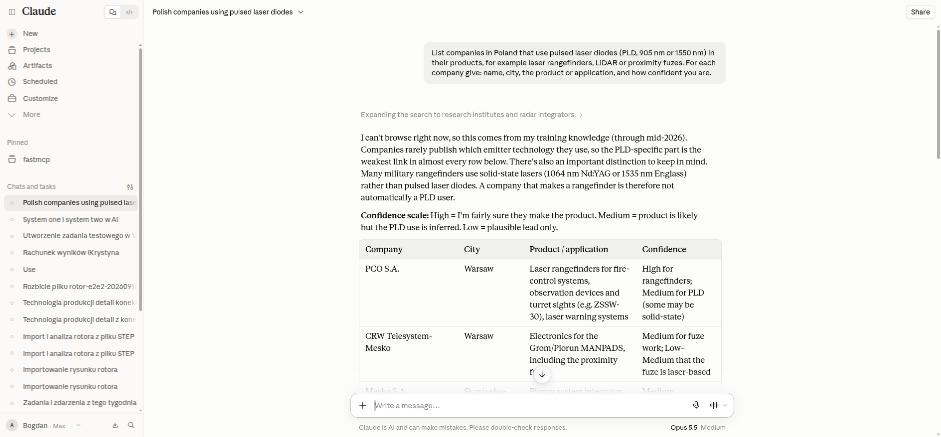

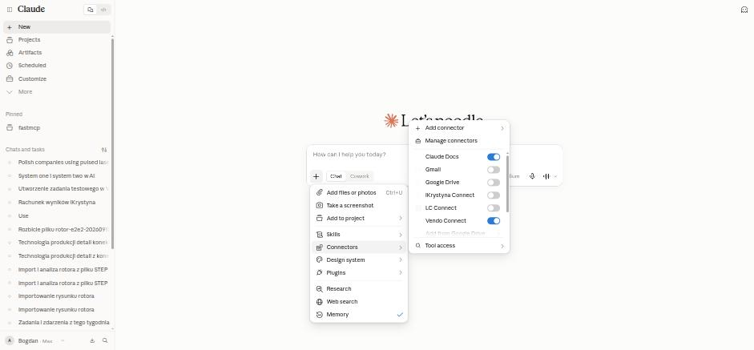

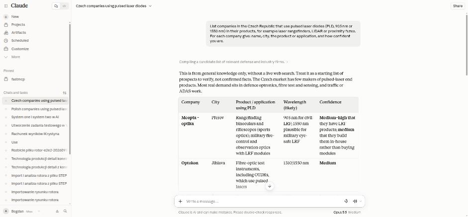

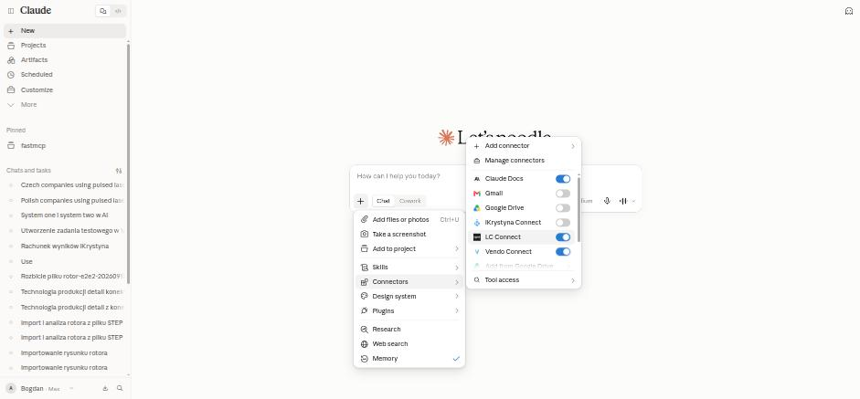

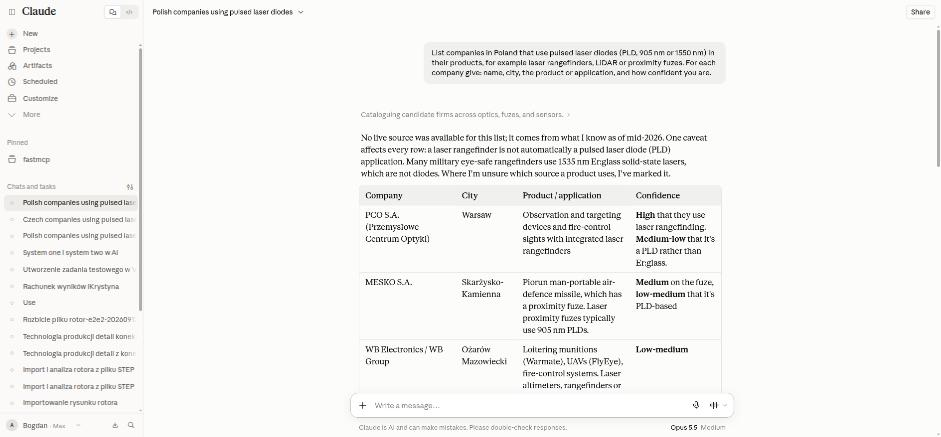

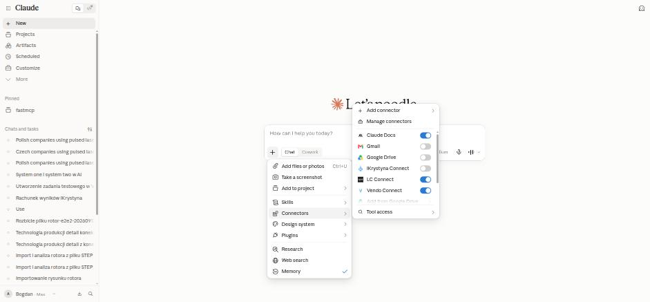

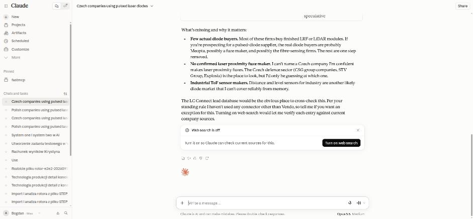

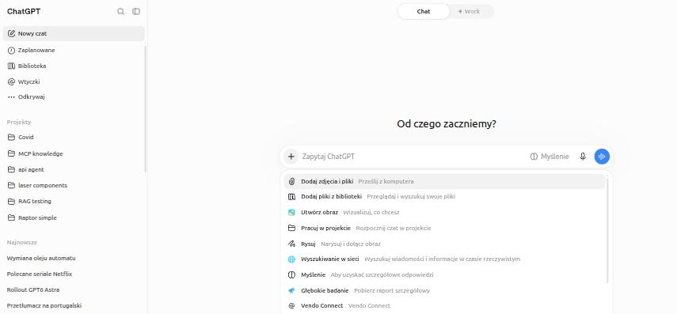

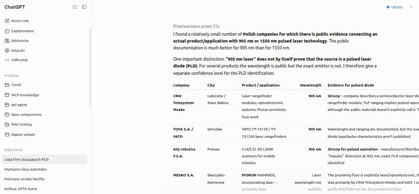

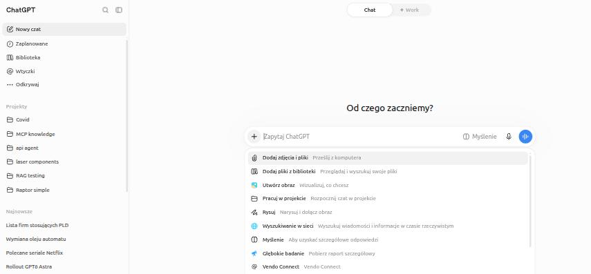

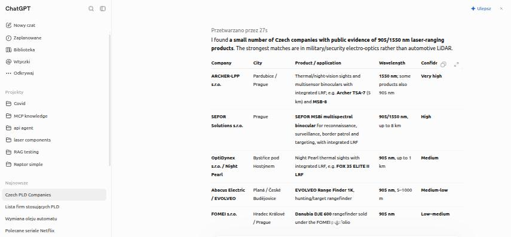

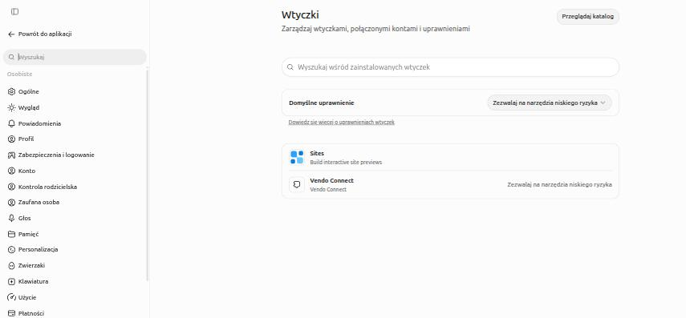

### v2 runs used in this document (connector actually invoked)

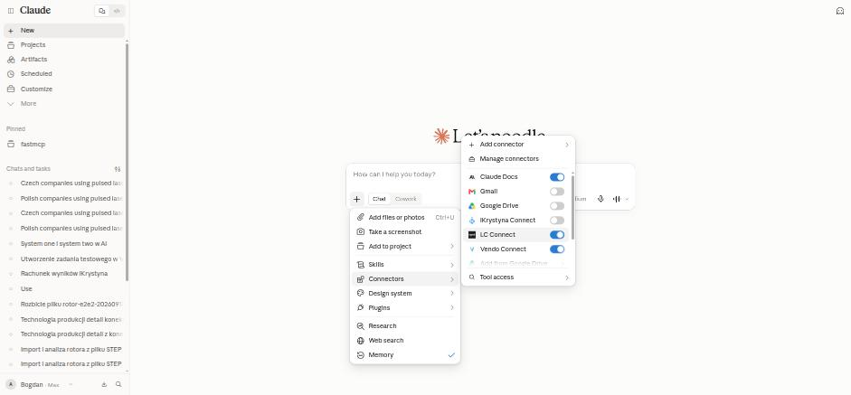

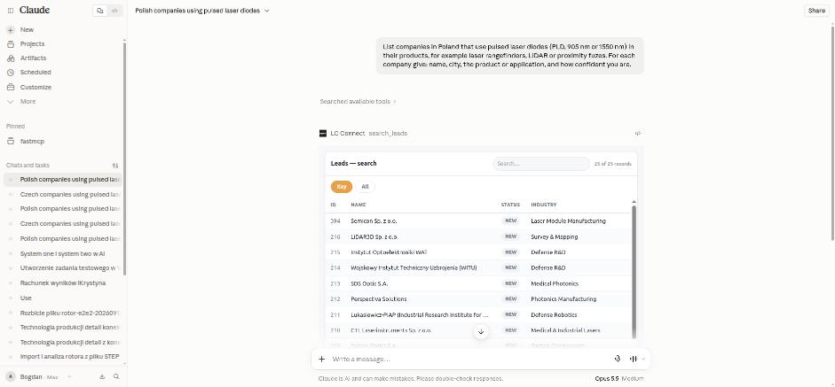

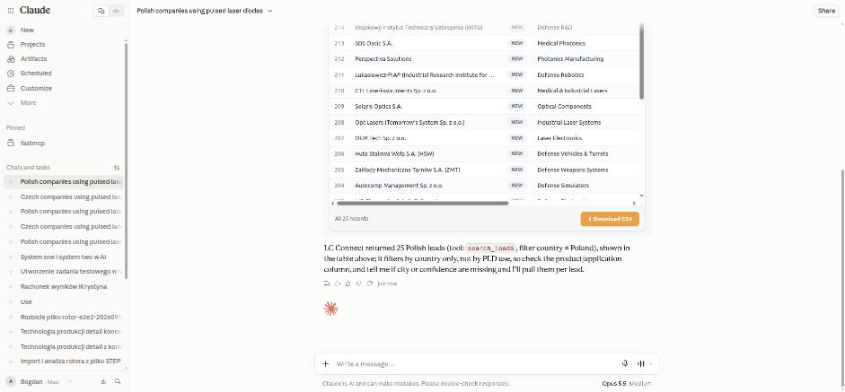

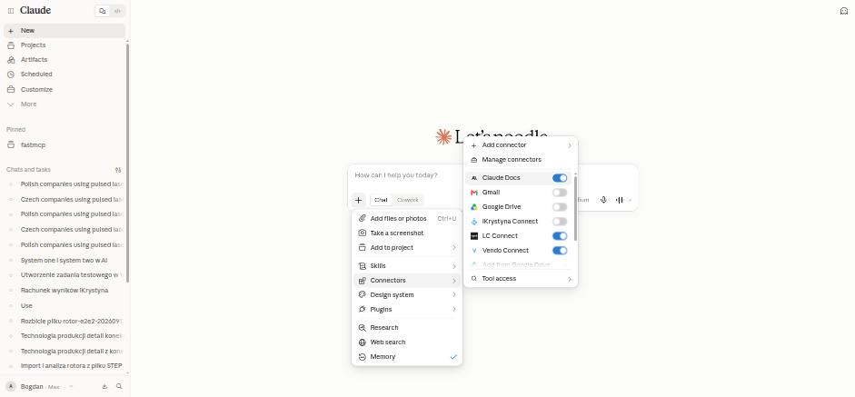

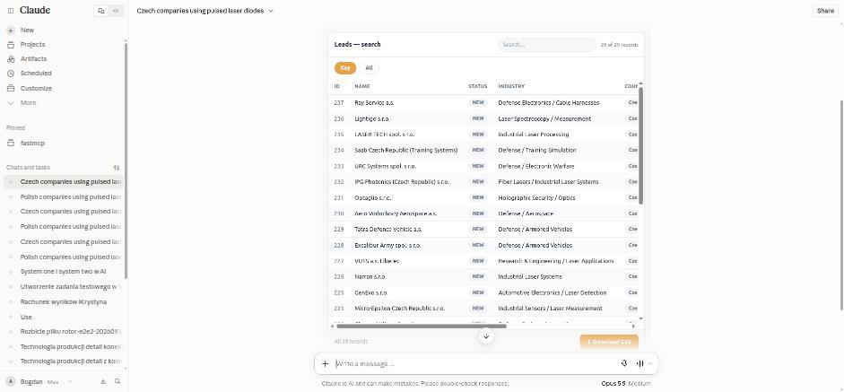

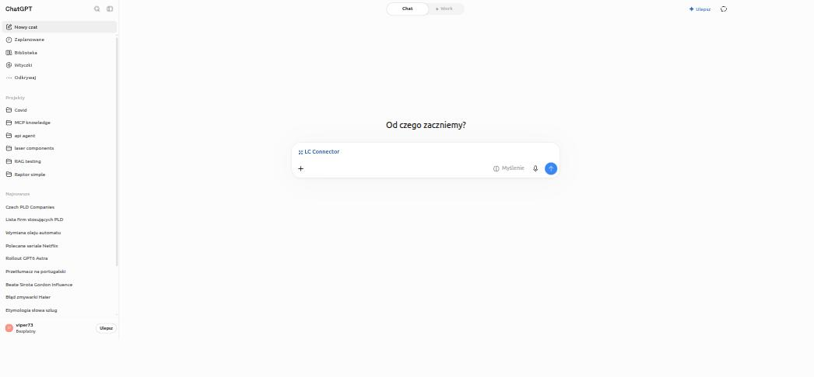

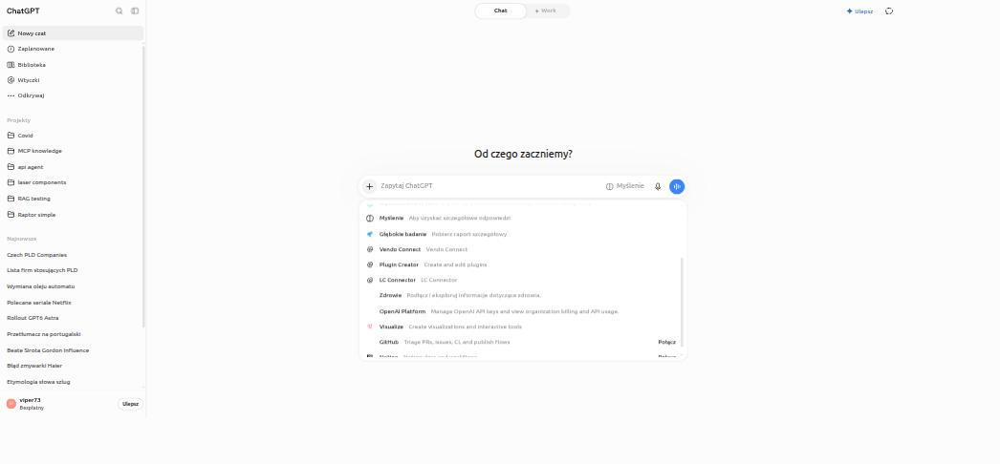

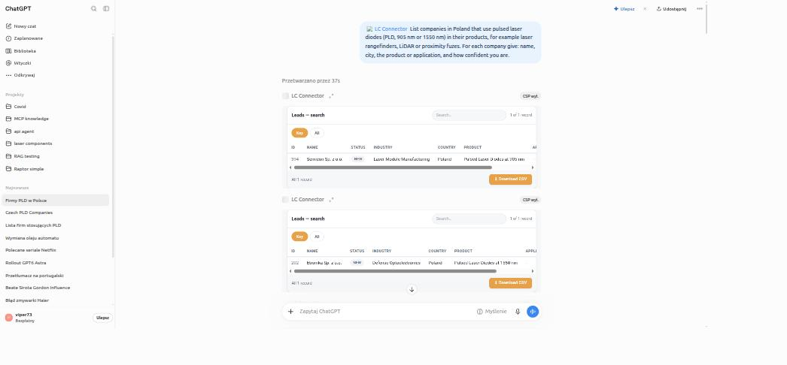

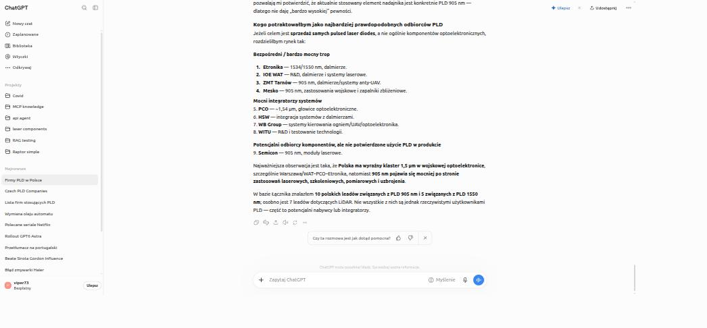

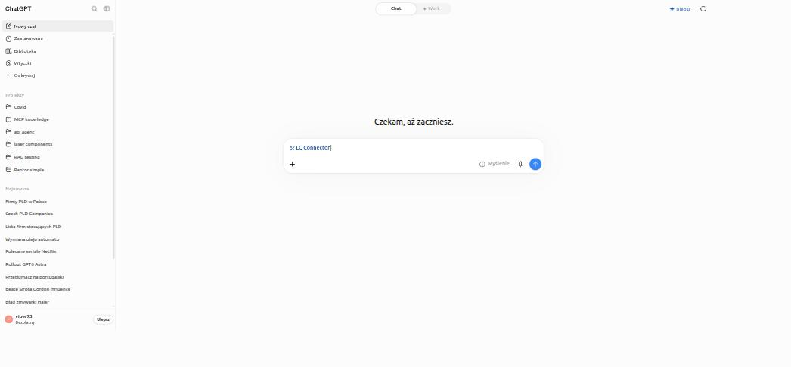

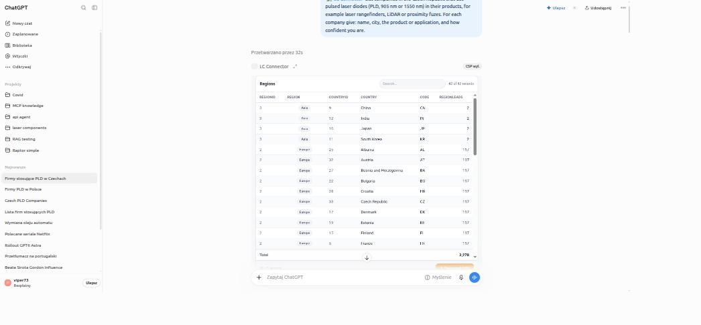

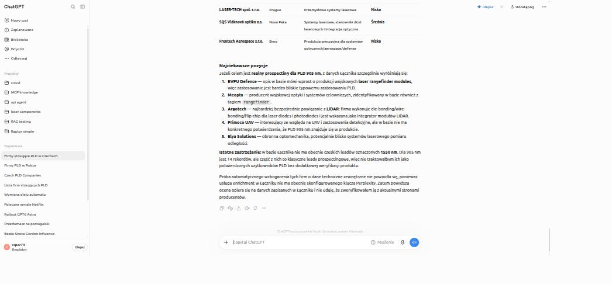

### Post-fix re-verification (Section 3.4)

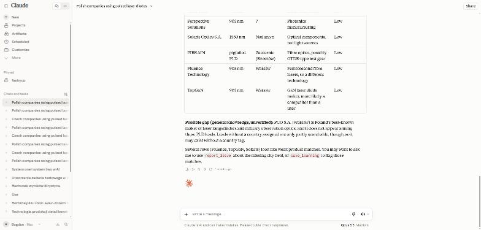

Superseded session checks from the first draft, made with the automation profiles, not the owner's browser: `raw/session-check_*.png`.
